# Casos de uso

Los dieciséis flujos que el sistema sabe hacer, derivados de las decisiones de
[CLAUDE.md](./CLAUDE.md). Cada uno con su mecanismo y las reglas duras (§13) que lo
gobiernan.

| ID | Caso de uso | Actor | Disparador | Resultado | Fase |
|---|---|---|---|---|---|
| UC-01 | [Capturar desde el chat](#uc-01--capturar-desde-el-chat) | Dueño | Manda un archivo, o escribe `/capture` | Memory con su blob y su texto | F0–F1 |
| UC-03 | [Aclarar y revisar](#uc-03--aclarar-y-revisar) | Bot → Dueño | Extracción de baja confianza | Memory verificada o en bandeja | F1–F2 |
| UC-04 | [Explorar y exportar](#uc-04--explorar-y-exportar) | Dueño | `/search` o listar categoría | Página de 5, o un PDF al chat | F0 |
| UC-05 | [Preguntar en lenguaje natural](#uc-05--preguntar-en-lenguaje-natural) | Dueño | Pregunta libre | Dato + cita, o "no lo tengo" | F3 |
| UC-06 | [Vigente, vencido o en conflicto](#uc-06--vigente-vencido-o-en-conflicto) | Dueño | Pregunta por un dato duro | Dato marcado según su vigencia | F6 |
| UC-07 | [Playbook de urgencia](#uc-07--playbook-de-urgencia) | Dueño | "Choqué el auto" | Respuesta pre-armada en menos de 2 s | F7 |
| UC-08 | [Nace una categoría](#uc-08--nace-una-categoría) | Dueño o bot | Se pide, o el bot detecta un patrón | Categoría activa, previa confirmación | F2 |
| UC-09 | [Reorganizar categorías](#uc-09--reorganizar-categorías) | Dueño | Renombrar, archivar o fusionar | Categorías al día, memorias intactas | F2 |
| UC-10 | [Crear espacio e invitar](#uc-10--crear-espacio-e-invitar) | Participante | `/invitar casa` | Persona adentro, sin cuenta ni clave | F5 |
| UC-11 | [Compartir una memoria](#uc-11--compartir-una-memoria) | Dueño de la memoria | Elige espacio y categoría | Fila en `memory_space` | F5 |
| UC-12 | [Retirar lo compartido](#uc-12--retirar-lo-compartido) | Dueño de la memoria | Deja de compartir, o sale | Relación borrada + aviso al espacio | F5 |
| UC-13 | [Categorías del espacio](#uc-13--categorías-del-espacio) | Participantes | Alguien o el bot propone | Aplicada, rechazada o caducada | F5 |
| UC-14 | [Corregir, ocultar, purgar](#uc-14--corregir-ocultar-purgar) | Dueño | El dato está mal o no debía estar | Corrección aditiva; purga auditada | F0+ |
| UC-15 | [Reprocesar](#uc-15--reprocesar) | Sistema | Mejora el carril, prompt o schema | Derivados regenerados desde el blob | F1+ |
| UC-16 | [Respaldo cifrado](#uc-16--respaldo-cifrado) | Sistema | Corre el backup programado | Respaldo off-site cifrado y probado | F0 |

**Cuatro caen en F0–F1** (UC-01, UC-04, UC-14, UC-16): son los que dan un sistema usable
antes de que exista un solo LLM en el pipeline.

---

## UC-01 · Capturar desde el chat
**Actor:** el dueño · **Disparador:** manda un archivo, o escribe `/capture` · **Fase:** F0–F1

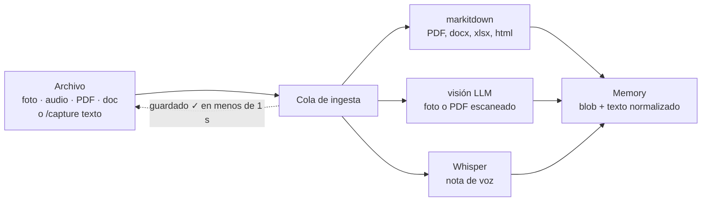

**Guardar es explícito, y solo en el chat.** Un archivo se guarda con mandarlo —sin
comando, sin categoría, que es §3.1—; un texto suelto se consulta, y para guardarlo hay
que escribir `/capture`. Invierte §5 a propósito: en una conversación lo que escribes es
casi siempre una pregunta, y adivinarlo con una heurística dejaba preguntas guardadas
como memorias. Si la consulta no encuentra nada, la respuesta ofrece guardar ese texto
tal cual, a un toque: no se pierde.

**El acuse no espera al trabajo pesado.** La cola responde de inmediato y la
normalización corre después, por el carril que corresponda (§8.1). Siempre se intenta
markitdown primero —barato y determinista— y solo cae a visión si el resultado viene
pobre. El carril usado queda registrado en la Memory para poder reprocesar (UC-15).

> Reglas: **4** máximo una pregunta por captura.

---

## UC-03 · Aclarar y revisar
**Actor:** el bot pregunta, tú respondes · **Disparador:** baja confianza · **Fase:** F1–F2

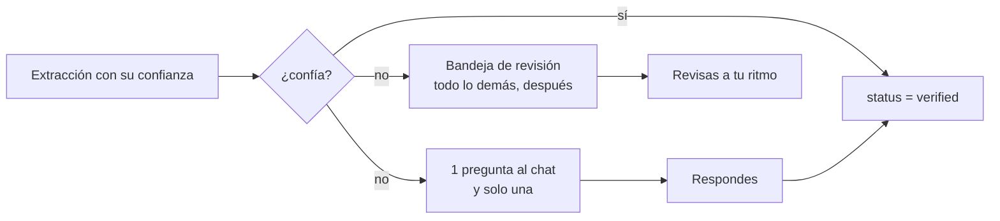

**La captura nunca se bloquea con preguntas.** Si el sistema duda, guarda igual: hace
como máximo una pregunta en el momento y difiere el resto. Guardar de más es barato;
perder algo por fricción es caro.

> Reglas: **4** máximo una pregunta por captura.

---

## UC-04 · Explorar y exportar
**Actor:** el dueño · **Disparador:** `/search` o listar una categoría · **Fase:** F0

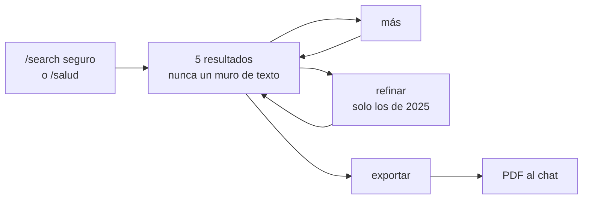

**El volumen no se resuelve con una web, se resuelve exportando.** Paginación y
refinamiento conversacional cubren el día a día; cuando de verdad hay que revisar muchas
cosas, la respuesta es un documento generado y enviado al chat (§6.1).

> Reglas: **9** filtro por dueño y membresía en toda consulta.

---

## UC-05 · Preguntar en lenguaje natural
**Actor:** el dueño · **Disparador:** pregunta libre · **Fase:** F3

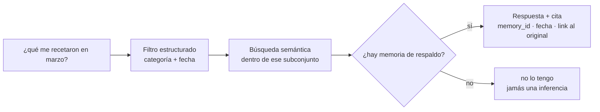

**Sin memoria de respaldo no hay respuesta.** El filtro estructurado va primero para que
la búsqueda semántica trabaje sobre poco y acierte más. Una inferencia plausible sobre
una receta médica es peor que un vacío.

> Reglas: **1** nunca un dato sin cita · **5** salud: devolver, no interpretar · **9** filtro.

---

## UC-06 · Vigente, vencido o en conflicto
**Actor:** el dueño · **Disparador:** pregunta por un dato duro · **Fase:** F6

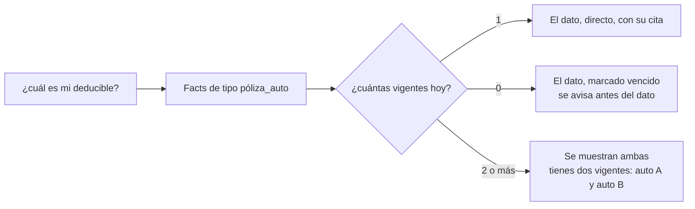

**El empate no se resuelve en silencio.** Una regla de "gana la más reciente" escondería
la segunda póliza sin que te enteres: dos autos son dos pólizas vigentes, no un
reemplazo. La vigencia decide cuando puede; el empate se muestra.

> Reglas: **2** conflicto a la vista · **3** vencido se dice antes del dato.

---

## UC-07 · Playbook de urgencia
**Actor:** el dueño, bajo presión · **Disparador:** "choqué el auto" · **Fase:** F7

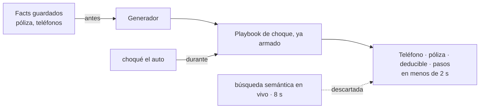

**El único caso donde el flujo del tiempo se invierte:** la respuesta se computa antes de
que la pregunta exista. Chocado en la calle no es momento para esperar ocho segundos a
una búsqueda probabilística. Se regenera cada vez que cambia la póliza que lo alimenta.

> Reglas: **1** nunca sin cita · **5** salud: no interpretar.

---

## UC-08 · Nace una categoría
**Actor:** el dueño o el bot · **Disparador:** se pide, o se detecta un patrón · **Fase:** F2

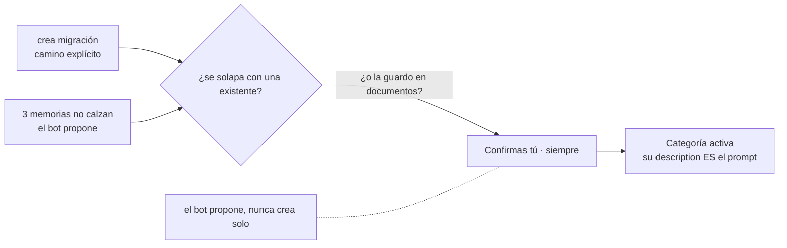

**No tienes que anticipar tus propias categorías.** El camino emergente es el que hace
que esto valga la pena: el sistema las descubre de tus datos. Pero sin el freno de la
confirmación, en seis meses tienes cuarenta categorías con la mitad solapadas.

> Reglas: **7** nunca crear, renombrar, archivar ni fusionar sin confirmación.

---

## UC-09 · Reorganizar categorías
**Actor:** el dueño · **Disparador:** renombrar, archivar o fusionar · **Fase:** F2

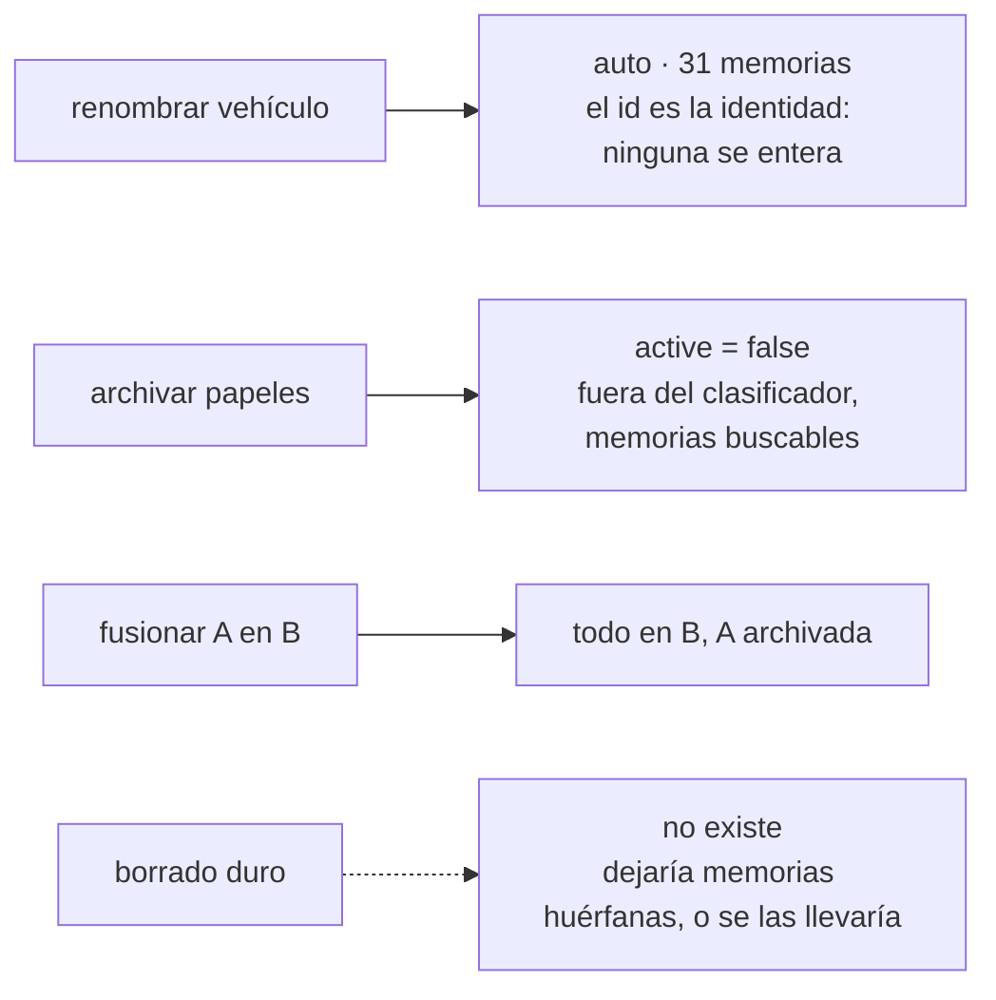

**Fusionar es la que vas a usar el 90% de las veces** — *"esto de 'papeles' en realidad
era 'documentos'"*.

> Reglas: **7** confirmación · **8** confirmar lo irreversible.

---

## UC-10 · Crear espacio e invitar
**Actor:** cualquier participante · **Disparador:** `/invitar casa` · **Fase:** F5

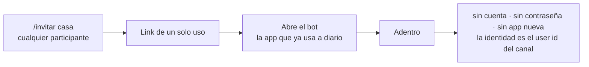

**El mayor beneficio práctico de ser solo chat.** No hay cuentas ni contraseñas porque la
identidad ya existe. Es lo que hace que invitar a un familiar sea realista y no una pelea
de soporte.

> Reglas: **11** nadie tiene autoridad sobre memorias ajenas.

---

## UC-11 · Compartir una memoria
**Actor:** el dueño de la memoria · **Disparador:** elige espacio y categoría · **Fase:** F5

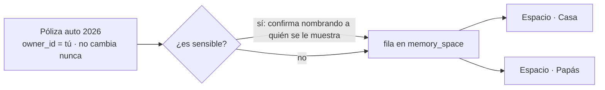

**Compartir es una relación, no una transferencia.** La misma memoria puede verse en
varios espacios sin duplicarse —los blobs son direccionables por contenido— y todo el
control queda en quien la capturó. El default siempre es privado: nada se comparte por
inercia.

> Reglas: **10** nombrar a quién se muestra · **11** sin autoridad ajena.

---

## UC-12 · Retirar lo compartido
**Actor:** el dueño de la memoria · **Disparador:** deja de compartir, o sale · **Fase:** F5

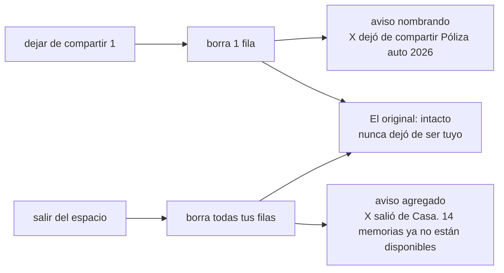

**Nada desaparece en silencio.** Es la contracara de que tus memorias se vayan contigo. El
aviso nombra la memoria porque quien estaba en el espacio **ya tenía acceso**: ocultar el
título no protegería nada y volvería el aviso inútil.

Límite honesto: retirar no es borrar de la cabeza del otro. Quien ya lo vio, ya lo vio —
y ahora sabe que lo retiraste.

> Reglas: **12** todo retiro se avisa · **11** sin autoridad ajena.

---

## UC-13 · Categorías del espacio
**Actor:** todos los participantes · **Disparador:** alguien o el bot propone · **Fase:** F5

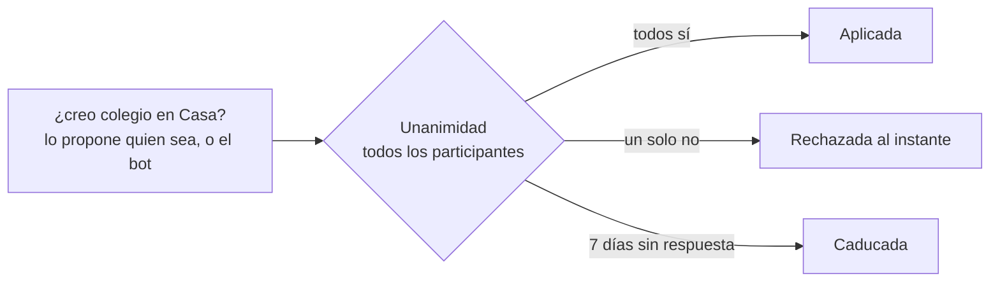

**Sin dueño del espacio, la estructura se decide entre todos.** Pero la unanimidad
necesita salida por tiempo o se vuelve parálisis: basta con que uno no lea el chat para
congelar el espacio para siempre. Las propuestas se ven con `/proposals`.

Solo se vota **cambiar** categorías. Usar las que ya existen es libre — si no, compartir
se vuelve insoportable.

> Reglas: **7** confirmación de todos los participantes.

---

## UC-14 · Corregir, ocultar, purgar
**Actor:** el dueño · **Disparador:** el dato está mal, o no debía estar · **Fase:** F0+

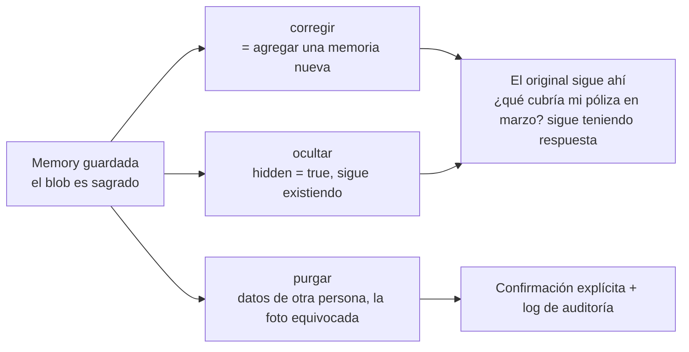

**Append-only, con una excepción honesta.** Prometer "es imposible borrar" es una promesa
que se rompe el día que la necesitas.

> Reglas: **8** confirmar lo irreversible.

---

## UC-15 · Reprocesar
**Actor:** el sistema · **Disparador:** mejora el carril, el prompt o el schema · **Fase:** F1+

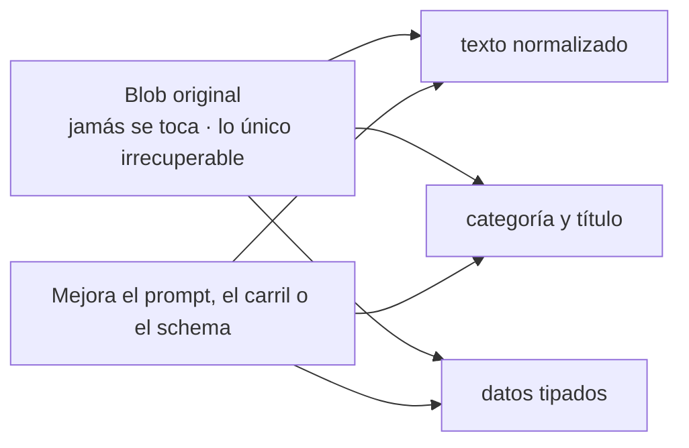

**Todo lo derivado es regenerable, y por eso el original es sagrado.** Es lo que te deja
mejorar la extracción sin miedo: se reprocesa el histórico completo desde los blobs, sin
pérdida.

---

## UC-16 · Respaldo cifrado
**Actor:** el sistema · **Disparador:** corre el backup programado · **Fase:** F0

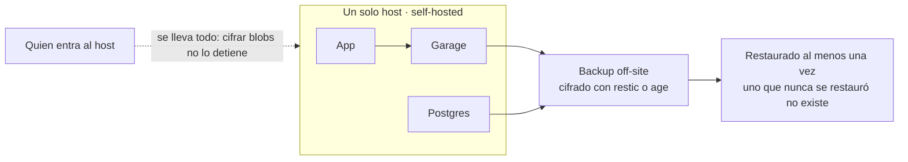

**Se cifra solo lo que sale del host.** Dentro del VPS, app, storage y claves conviven:
un cifrado cuya llave está al lado de la cerradura es ceremonia. El backup off-site es el
único lugar donde los datos duermen en infraestructura ajena, y ahí sí es obligatorio.

La passphrase del backup la guardas tú: se muestra una vez y no hay recuperación.

Antes que cualquier cifrado de blobs van: **cifrado de disco del host**, Postgres y Garage
sin puerto expuesto, secretos fuera del repo, y un backup restaurado.

**Y la incomodidad que ordena las prioridades:** el texto en claro ya sale de la caja por
diseño —al proveedor de LLM y por un chat que no es E2E—. Los controles que mueven la
aguja son un proveedor con retención cero y asumir conscientemente qué ve Telegram.

> Asume self-hosted, un dueño, un host. Si eso cambia, el cálculo se rehace (§14.2).
